# 🎓 School Management System


A complete **School Management System** to manage students, teachers, administration, finances, and academic results.

---

# 📌 Features

✔ Student Management
✔ Teacher Management
✔ Administrative Staff Management
✔ Student Grades & Results
✔ School Fees Management
✔ Salary Management
✔ Financial Tracking
✔ Reports & Statistics

---

# 🖼 Screenshots

### Main Screen

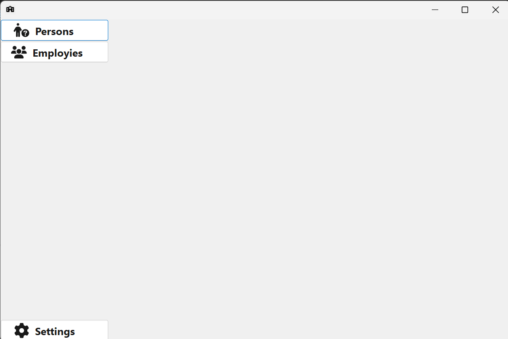

### Login Screen

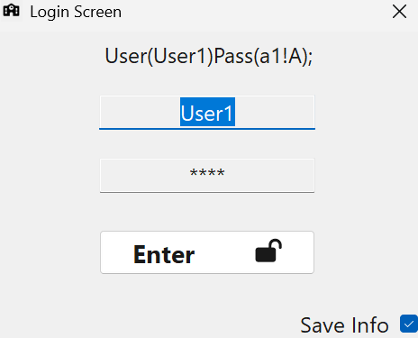

### Add Person / Student

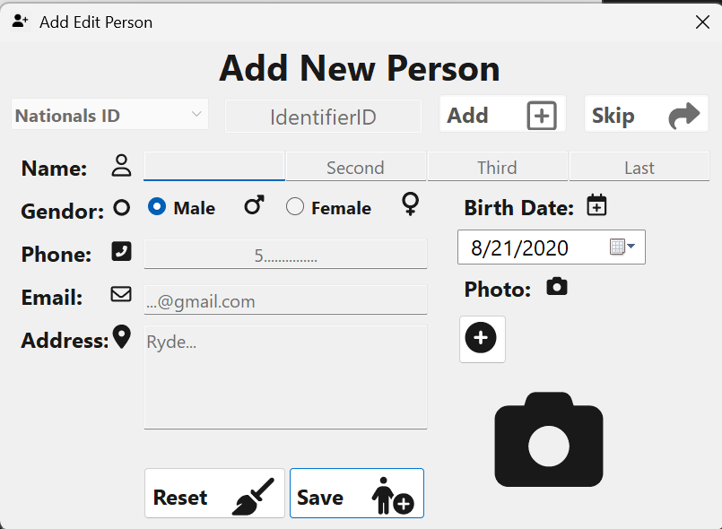

### Person Details

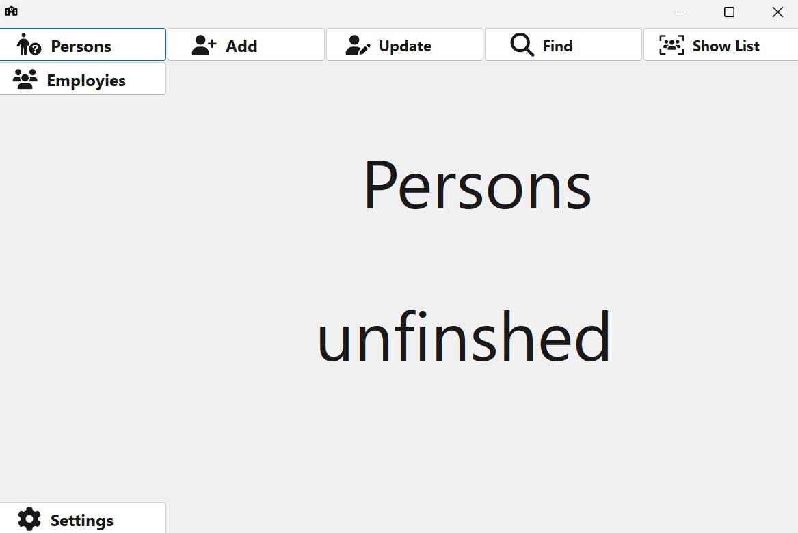

### Show List

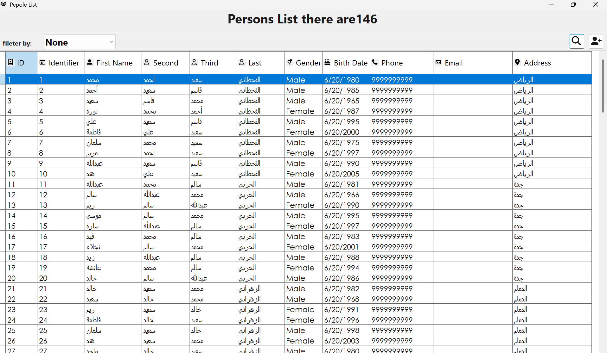

### Application Settings

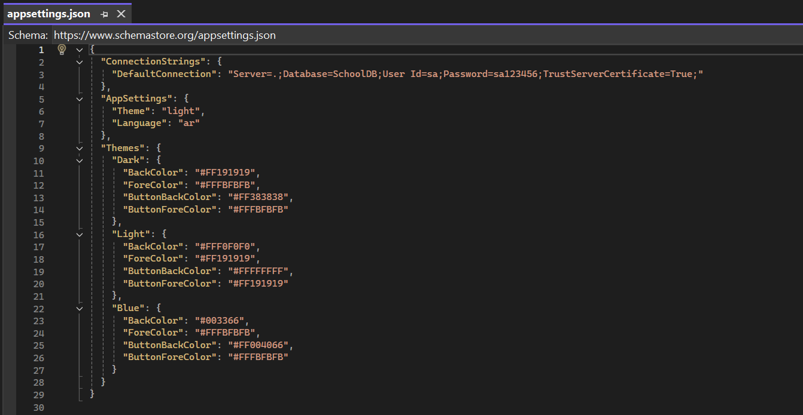

### Themes

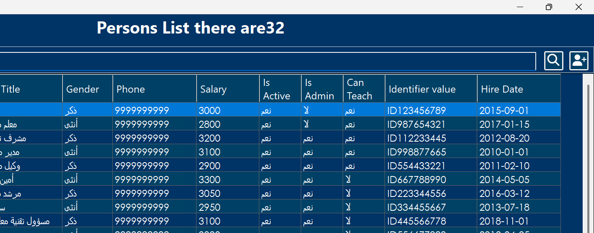
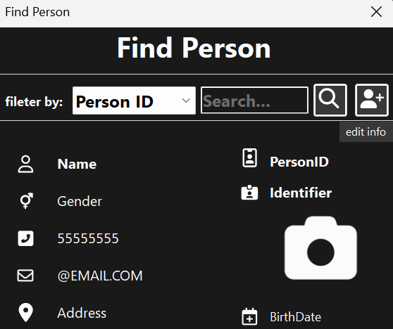

### Code Structure / Pattern

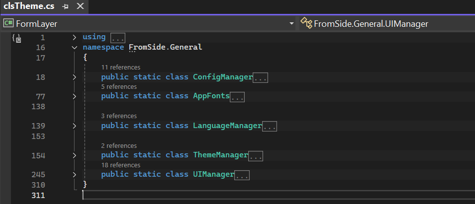

### Architecture Diagram

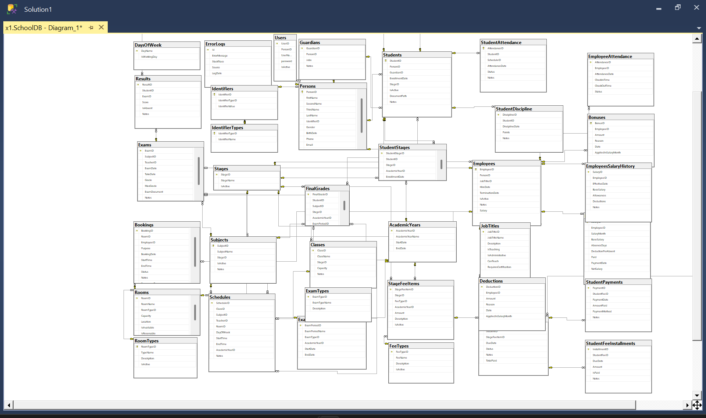

### Procedures / Workflows

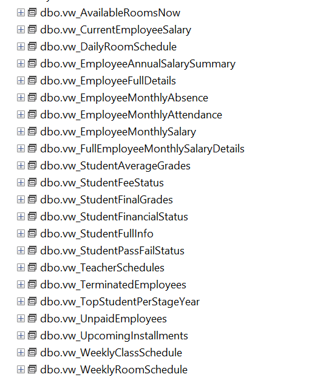

### Type Architecture

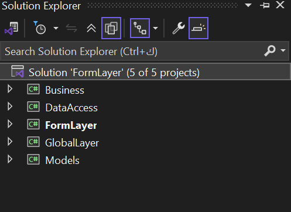

> All screenshots are located in the **pic/** folder.

---

# ⚙️ Installation Guide

Follow these steps to run the system locally.

## 1️⃣ Restore the Database

Open **SQL Server Management Studio** and restore the database located in:

```
Database/
```

Make sure the database name is:

```
SchoolDB
```

---

## 2️⃣ Change Database Owner

Run:

```sql
ALTER AUTHORIZATION ON DATABASE::SchoolDB TO sa;
```

---

## 3️⃣ Configure Connection String

Open the project in Visual Studio and update connection string if necessary:

```text
Server=.;Database=SchoolDB;Trusted_Connection=True;
```

---

## 4️⃣ Run the Project

1. Build the solution in Visual Studio
2. Run the application
3. You should see the system running with the main screen

---

# 🛠 Technologies Used

* C#
* .NET
* SQL Server
* HTML / CSS
* JavaScript

---

# 👨‍💻 Author

**Abdullah Dabwan**
GitHub: [abdullahdabwan-tech](https://github.com/abdullahdabwan-tech)
Telegram: @Abdullah_Soft_Dev

---

⭐ Give a star on GitHub if you like the project!
